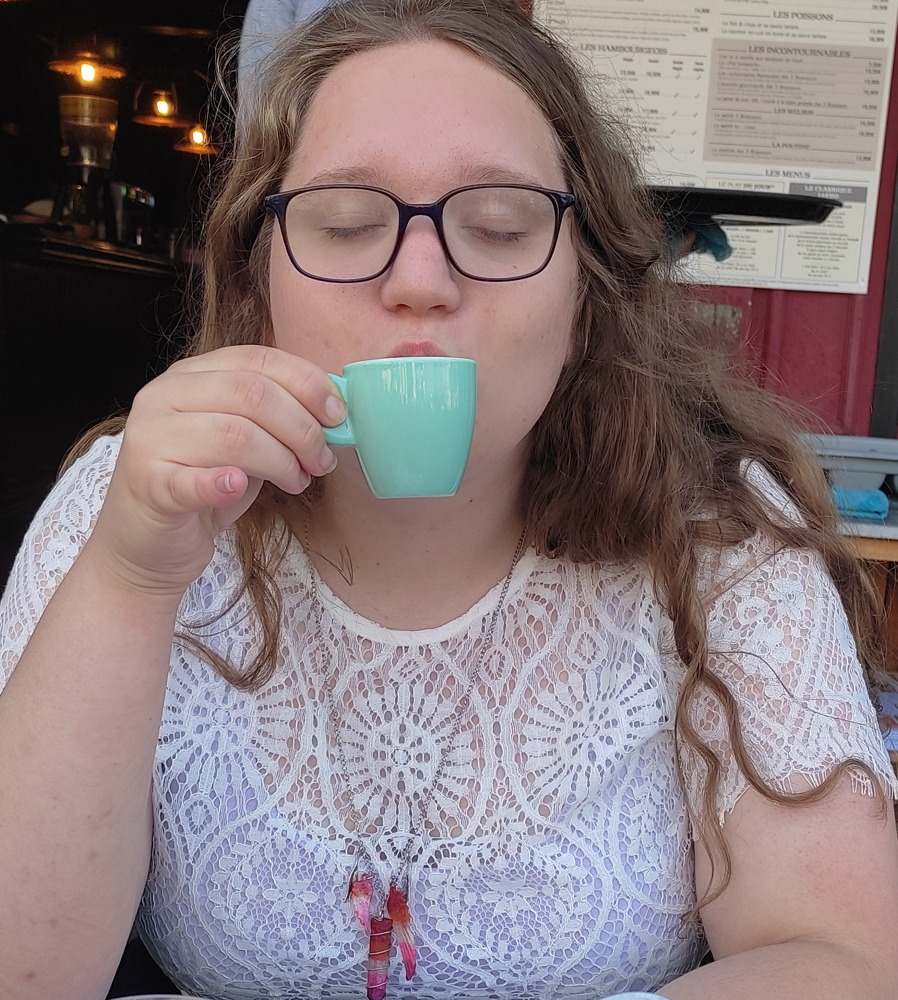

<h1>Cmdr. Charlotte Thomas</h1>

# Officer designation
*Name*: Charlotte Thomas  
*Rank*: Commander  
*Assignment*: Chief Science Officer, USS Versailles, Region 9  
*Previous Assignment*: Second Officer, USS Versailles, Region 9  
*Date of Birth*: 12 May 2002, (Age 19)  
  

# Biography
## Introduction
Hey! I entered STARFLEET International on January 3, 2019. I answered the call from Bruno to form a fully french (and later french speaking) chapter. Early on I started drafting the work for the Science Department of the Versailles. I programmed tools such as a STARFLEET CV Generator (with design help from Arnaud, a former member of SFI and the Versailles) or [ARS](https://github.com/sfi-region9) to build a simple automatic and efficient reporting system.  

I was also really active in the STARFLEET Academy, earning the Blue Squad Leader (Cadet equivalent of the Red Squad Leader Award) Award for the year 2020, and other Academic and diplomatic awards. I also serve as Second Officer for our second Commanding Officer for quite some time before I stepped down in favor or Anne-Laure, being overwhelmed with my studies.  

## Personal life
I'm a huge nerd, and a theoretical computer scientist, I code in Java and OCaml. The "Prépa" -- a french weird harder alternative of University to prepare for the *concours des Grandes Écoles* -- used a lot of my time these past two years, even if I met some truly awesome friends there (and to be honest covid did not help *at all*), forcing me to stop my other projects (such as ARS), and to practically nullify my STARFLEET engagement, being a bit spectral for two years.  

I'm transgender and intersex, and really engaged in my local intersectional feminism movement, I work for recognition of LGBTI+ people, towards improving our rights and freedom of live not only in my country but in the world. I also do some education stuff for allies or cis straight people desiring to become allies. 

--- 

Now with the end of Prépa in sight I'm gently resuming my engagement in STARFLEET, and towards my other project. I recently started to write a web novel **A Galactic HRT**, which's website is available [here](https://agh.nwa2coco.fr), to write a LaTeX to HTML compiler, hosted on [GitHub](https://github.com/coco33920/HTMLFromTeXBooks) with the MIT License, and finally to work on my own exotic programming language, the **Baguette#**, a programming language honoring the famous French pastries, you can see and play with it [here!](https://www.baguettesharp.fr)  

# Misc

## Contact
[*Personal Website/CV*](https://me.nwa2coco.fr)  
[*A Galactic HRT*](https://agh.nwa2coco.fr)  
[*Baguette#*](https://baguettesharp.fr)  
[*Mail*](mailto:contact@nwa2coco.fr)
[*Mail | Baguette#*](mailto:contact@baguettesharp.fr)

## Social Media
[Instagram](https://instagram.com/coco33920.0)  
[Twitter](https://twitter.com/coco33920)  
[GitHub](https://github.com/coco33920)  

## Notable Awards
* Blue Squad Member 2020
* Blue Squad Leader 2020

## Favourite Award
My favourite award of all time is (and will always be!) the Diplomatic Certificate of Appreciation from the Rear Admiral Caroline Signol, Ambassador of the USS Ronald. E. McNair, R1 :)

